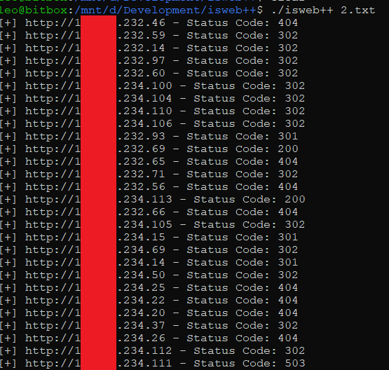

 <h1 align="center">isweb++<br>Fast & Lightweight HTTP/s checker</h1>


### Usage
```
Usage: isweb++ [host file]

```
### Main Features
     - Pass a list of subdomains or IPs and get the HTTP/s served ones along with their status code
     - Multithreaded
     - Easy to use

#### TODO:
     - [ ] "Just create a new issue and your suggestion will be welcomed!"

#### Build:
```
g++ -g main.cpp -o isweb++ -Iboost/ -Lboost/ -lresolv -lpthread
```

#### Bugs / Feedback / PRs
Any comment, issue or pull request will be highly appreciated :)

#### Author
b1twis3 - https://twitter.com/fasthm00

### Demo


### pure-line inspiration
This repository is inspired by https://github.com/tomnomnom/httprobe.

And the code of this repository is based on https://www.boost.org/ docs.
